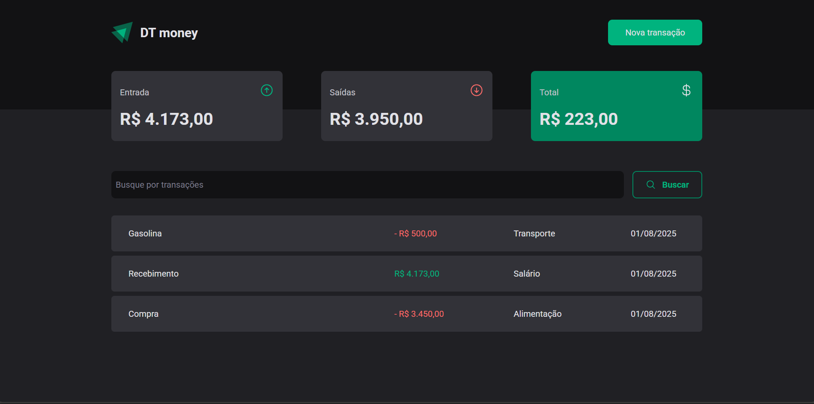

<h1 align='center'>
  DT-money
<br />
<br />
  
</h1>
<br />

## 🧪 Tecnologias
O projeto foi desenvolvido com as seguintes tecnologias:

- [React](https://react.dev/)
- [Typescript](https://www.typescriptlang.org/)
- [Json Server](https://github.com/typicode/json-server/tree/v0)

## 🎯 Objetivo
O DT-money é um organizador financeiro que tem como objetivo permitir ao usuário um fácil gerenciamento dos seus gastos e recebimentos.

## Como executar 
Para iniciar o projeto por conta própria ou modificá-lo, siga os seguintes passos:

```bash
# Faça o clone do projeto
$ git clone https://github.com/pdanmt/DT-money

# Entre na pasta criada
$ cd DT-money
```
Instale as dependências e inicialize o projeto usando o npm:

```bash
$ npm i

$ npm run dev
```
A aplicação estará rodando no endereço http://localhost:5173/

Além disso, será necessário que você inicie o json-server. Para isso, use o seguinte comando:

```bash
$ npx json-server --watch server.json
```

Caso queira acessar a api, ela estará rodando no endereço http://localhost:3000/

---